# Task 2 — Technical Plan: Design Patterns + Domain-Specific Test Strategy

## Why this exists

After the Task 1 cut (261 → 243 Qs), two real gaps remain in the corpus:

1. **No design-patterns category for automation frameworks.** The
   `frameworkArch` and `automationFrameworks` categories talk about *which
   framework* to pick and *how to organise files*, but never name the
   GoF / Fowler patterns that senior interviews probe (Page Object,
   Screenplay, Builder, Strategy, Factory, Singleton-trap, Decorator,
   Adapter, Observer, Command, etc.) or contrast them with their actual
   trade-offs.
2. **No domain-specific test-strategy material.** A senior QA in
   logistics, healthcare, payments, e-commerce, or medical/regulated
   tests *very* differently from a SaaS QA. The corpus is generic — it
   teaches "test the pyramid" but never "this is what testing looks like
   when downtime costs €40k/min in payments, or when you need
   ISO 13485 traceability in medical."

This plan adds both in **6 small chunks** so each can land independently,
each ships ≤ 12 questions, and the corpus stays under ~310 Qs total —
not back to the bloated 297 we started with.

---

## Scope guardrails

- **Cap total Qs at ~325** post-Task-2 (currently 243). That's ~80 new
  Qs spread across 8 chunks. Hard ceiling — if a chunk threatens it,
  trim before merging. (Cap revised up from 310 after the deeper
  design-patterns survey.)
- **No new top-level categories beyond two:** "Design Patterns &
  Architecture" (new) and "Domain Playbooks" (new). Everything else
  extends existing categories.
- **One PR / one commit per chunk.** Easier to review, easier to roll
  back if one chunk's quality is off.
- **Quality gate:** every new Q includes at least one of {code example,
  diagram, decision table, anti-pattern callout}. Pure prose Qs don't
  ship.
- **Every design-pattern Q ships with a Mermaid structural diagram** —
  this is the explicit reason for the Chunks 1–4 deepening.

---

## Honest note before the patterns section

The earlier draft of this plan named ~10 patterns (POM, Screenplay,
Builder, Factory, Singleton, Decorator, Adapter, Composite, Facade,
Prototype) and called it done. That was wrong — POM is a *single*
pattern in a large landscape of test-automation patterns drawn from
four sources:

1. **GoF — *Design Patterns*** (Gamma/Helm/Johnson/Vlissides, 1994).
   23 classical OO patterns. Most relevant to test code: Strategy,
   Adapter, Facade, Decorator, Builder, Factory Method, Composite,
   Observer, State, Template Method, Command, Singleton (mostly as a
   trap), Proxy, Bridge.
2. **xUnit Test Patterns** (Gerard Meszaros, 2007). The canonical
   reference for test-specific patterns: the four-phase test, the
   five test doubles (Dummy/Stub/Spy/Mock/Fake), Object Mother, Test
   Data Builder, Shared Fixture vs Fresh Fixture, Hexagonal in tests.
3. **Growing Object-Oriented Software, Guided by Tests** (GOOS —
   Freeman/Pryce, 2009). London-school TDD, mock objects, walking
   skeleton, end-to-end-first test strategy.
4. **The Screenplay Pattern** (Marcano/Palmer/Molak, Serenity BDD).
   Actor / Task / Ability / Question. Solves POM's "page god-object"
   trap for complex flows.

Plus QA-specific patterns that emerged in practice: App Actions
(Cypress team), Robot pattern (Jake Wharton), Page Component (Martin
Fowler), Test Pyramid / Trophy / Diamond / Honeycomb shapes (Mike
Cohn → Kent C. Dodds → Spotify).

The expanded Chunks 1–4 below cover ~40 of these patterns with
structural diagrams. That's the right depth for a senior interview —
naming 3 patterns gets you junior; naming and *contrasting* 15+ with
trade-offs is the senior signal.

---

## Pattern landscape — the family map (Chunks 1–4 at a glance)

```mermaid
graph TB
  ROOT["Test Automation<br/>Design Patterns"]

  ROOT --> UI["Chunk 1<br/>UI / Page modelling"]
  ROOT --> DATA["Chunk 2<br/>Test Data + Test Doubles"]
  ROOT --> GOF["Chunk 3<br/>GoF in test code<br/>(structural + behavioral)"]
  ROOT --> ARCH["Chunk 4<br/>Architectural + principles + anti-patterns"]

  UI --> UI1[Page Object Model]
  UI --> UI2[Fluent Page Object]
  UI --> UI3[Page Component]
  UI --> UI4[Screenplay]
  UI --> UI5[App Actions]
  UI --> UI6[Robot pattern]
  UI --> UI7[Hexagonal / Ports]

  DATA --> D1[Test Data Builder]
  DATA --> D2[Object Mother]
  DATA --> D3[Faker / Generator]
  DATA --> D4[Factory Method]
  DATA --> D5[Abstract Factory]
  DATA --> D6[Prototype]
  DATA --> TD["Test Doubles<br/>(Meszaros)"]
  TD --> TD1[Dummy]
  TD --> TD2[Stub]
  TD --> TD3[Spy]
  TD --> TD4[Mock]
  TD --> TD5[Fake]

  GOF --> S["Structural"]
  GOF --> B["Behavioral"]
  S --> S1[Adapter]
  S --> S2[Facade]
  S --> S3[Decorator]
  S --> S4[Composite]
  S --> S5[Proxy]
  S --> S6[Bridge]
  B --> B1[Strategy]
  B --> B2[Observer]
  B --> B3[Template Method]
  B --> B4[Chain of Responsibility]

  ARCH --> A1[Singleton trap]
  ARCH --> A2[Dependency Injection / IoC]
  ARCH --> A3[Repository for test data]
  ARCH --> A4[State machine pattern]
  ARCH --> A5[Command / Memento]
  ARCH --> P["Principles + anti-patterns"]
  P --> P1[SOLID applied]
  P --> P2[DRY vs DAMP]
  P --> P3[Four-phase test / AAA / GWT]
  P --> P4["Anti-patterns<br/>(sleep abuse, fragile selectors, test interdep.)"]
  P --> P5["Pyramid / Trophy /<br/>Diamond / Honeycomb"]
```

---

## Chunk 1 — UI / Page Modelling Patterns

**New category: `designPatterns` (10 Qs)**

The patterns that decide how a test *talks to* the UI. POM is the
default; everything else here is "POM plus" or "instead of POM".

| # | Pattern | Diff | What it solves | Trade-off |
|---|---|---|---|---|
| 1 | **Page Object Model (POM)** | mid | Encapsulate page selectors + actions behind a class; tests speak intent. | Becomes a god-object on big pages. |
| 2 | **Fluent Page Object** | mid | Chain actions: `login.enterEmail().enterPassword().submit()`. | Less natural for branching flows. |
| 3 | **Page Component (Component Object)** | mid | Page composed of small reusable component classes (`Header`, `CartDrawer`). | More files; cleaner at scale. |
| 4 | **Screenplay Pattern** | hard | Actor performs Tasks using Abilities, asks Questions. Replaces page-as-noun with actor-as-verb. | Higher floor of complexity; pays off on multi-step flows. |
| 5 | **App Actions** (Cypress) | mid | Bypass UI for setup: hit the app's API/state directly to arrive at the state under test. | Faster + less flaky; only tests what the user *would* do *after* setup. |
| 6 | **Robot Pattern** (Wharton) | mid | Test reads as English sentences via a thin DSL above POM. | Maintenance: keep robot + POM in sync. |
| 7 | **Hexagonal / Ports & Adapters in test code** | hard | Tests target a domain port; UI/API/CLI adapters are swappable. | Same test runs unchanged on UI ↔ API ↔ contract. |
| 8 | **Test Pyramid of UI patterns** | hard | Which UI pattern belongs at which test level — and the "Honeycomb / Diamond" alternatives. | Picking the wrong shape multiplies cost. |
| 9 | **POM anti-pattern catalogue** | mid | Assertions in POM, hard waits in POM, hand-rolled retries, locator concatenation in tests. | Each anti-pattern has a refactor recipe. |
| 10 | **POM ↔ Screenplay migration** | hard | Concrete steps to move a 50-class POM suite to Screenplay incrementally. | Not always worth it; the audit goes first. |

### Structural diagrams — Chunk 1

**Page Object Model**

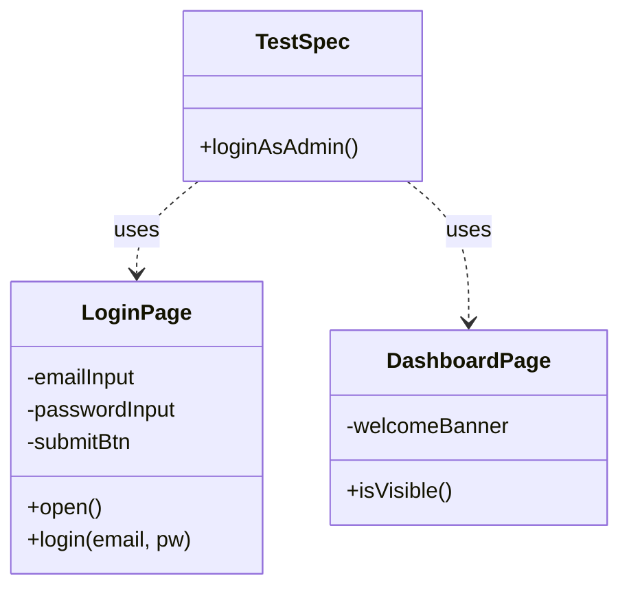

**Page Component (composition over inheritance)**

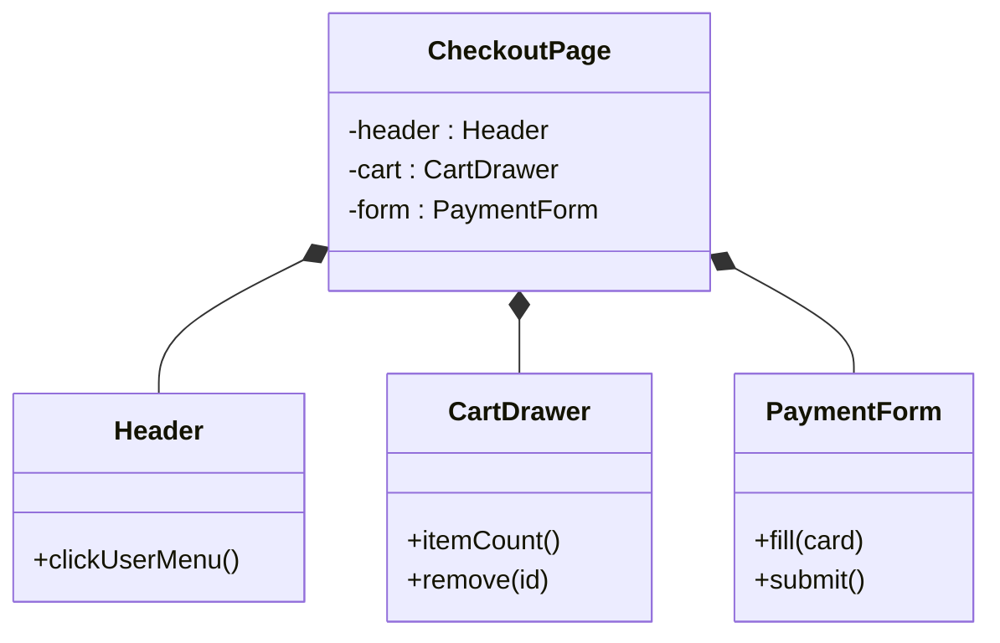

**Screenplay**

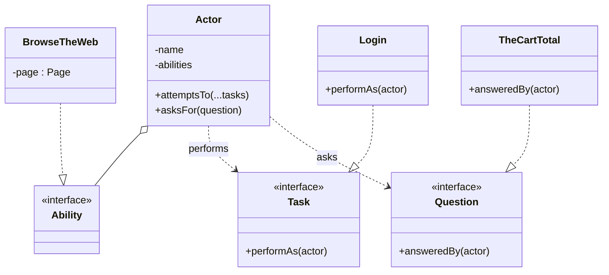

**Hexagonal / Ports & Adapters in tests**

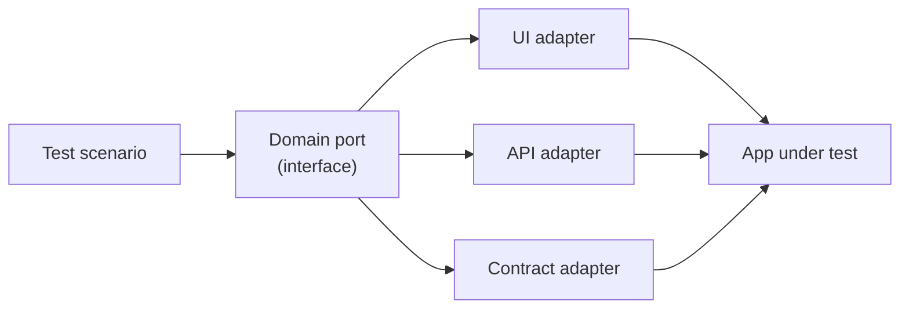

---

## Chunk 2 — Test Data + Test Doubles

**Extends `designPatterns` (10 Qs)**

Half of test code is "get the system into the right state". This chunk
covers both the data-creation patterns (Meszaros + GoF creational) and
the five test doubles that get over-conflated in interviews.

| # | Pattern | Diff | What it solves | Source |
|---|---|---|---|---|
| 1 | **Test Data Builder** | mid | Fluent partial-override: `aUser().withEmail("x").verified().build()`. Encapsulates defaults. | Meszaros |
| 2 | **Object Mother** | easy | Named canonical fixtures: `Mother.aVerifiedAdminUser()`. Trades flexibility for readability. | Meszaros |
| 3 | **Faker / random data generator** | easy | Auto-generates plausible names/emails/cards. Anti-pattern: random data without seeding. | Industry |
| 4 | **Factory Method** | mid | One method, one type; subclass to vary. Often over-applied in test code. | GoF |
| 5 | **Abstract Factory** | hard | Whole family of related fixtures (e.g. "production-like data set" vs "minimal smoke set"). | GoF |
| 6 | **Prototype** | easy | `structuredClone(baseFixture)` for variants without re-running setup. | GoF |
| 7 | **Five test doubles** (overview) | mid | Dummy / Stub / Spy / Mock / Fake — what each is, when to use, when interview answers conflate them. | Meszaros + Fowler |
| 8 | **Mock vs Stub** | mid | Interaction-based verification vs state-based verification — Fowler's "Mocks Aren't Stubs". | Fowler |
| 9 | **Fake** | hard | A working but simplified implementation (in-mem repo, in-mem queue). Why fakes scale better than mocks at integration level. | Meszaros |
| 10 | **Mock-hell anti-pattern** | hard | Over-mocking → tests verify implementation, not behaviour. Refactor with the "mock only what you own" rule. | GOOS |

### Structural diagrams — Chunk 2

**Test Data Builder**

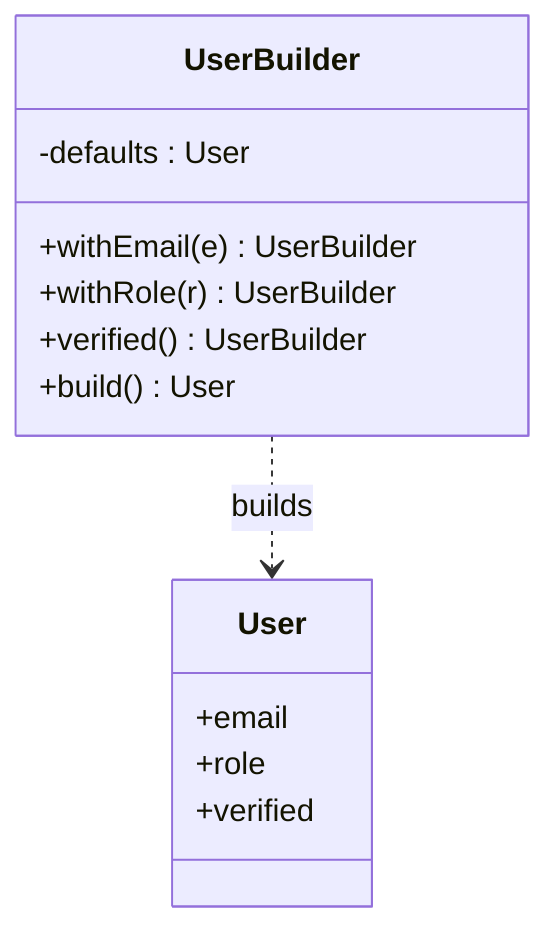

**The five test doubles (Meszaros taxonomy)**

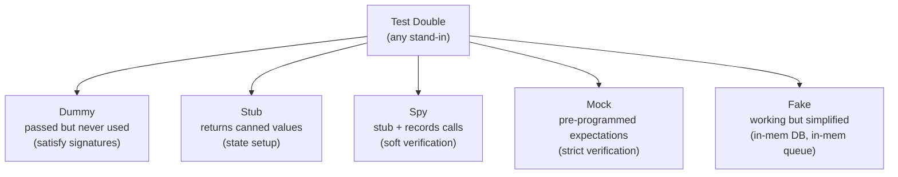

**Mock vs stub (verification axis)**

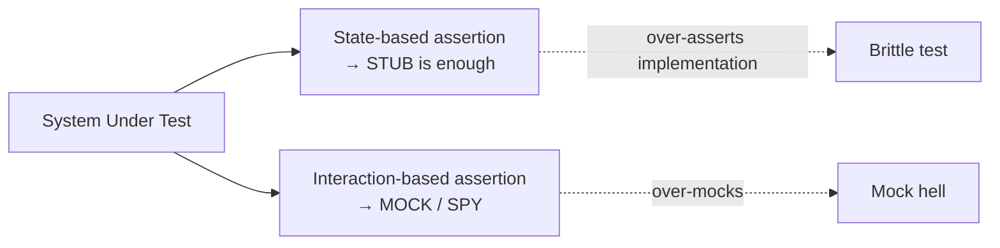

---

## Chunk 3 — GoF Structural + Behavioral in Test Code

**Extends `designPatterns` (10 Qs)**

The classical GoF patterns aren't an academic checklist — each one
solves a *specific* problem that recurs in test frameworks. This chunk
covers the 10 that actually show up.

| # | Pattern | Diff | Test-code use case |
|---|---|---|---|
| 1 | **Adapter** | mid | Wrap an unstable third-party SDK behind a test-stable interface (Stripe SDK 2 → 3 migration). |
| 2 | **Facade** | mid | `TestContext` — one object hides DB seeding + API auth + UI navigation. |
| 3 | **Decorator** | hard | Add retry / timing / logging to any test function without touching its body. TS generics preserve the return type. |
| 4 | **Composite** | mid | Build scenario suites from atomic steps (BDD without Cucumber). |
| 5 | **Proxy** | hard | Network-interception proxy (Playwright `route()`); also: lazy-loaded page objects. |
| 6 | **Bridge** | hard | Decouple test logic from driver (Selenium vs Playwright vs WebDriverBiDi). Same test, swappable runtime. |
| 7 | **Strategy** | mid | Auth strategy: fast-token vs login-via-UI vs storage-state — selected at runtime per env. |
| 8 | **Observer** | hard | Custom reporter listens to test events (start/finish/fail) → emits Datadog metrics, Allure attachments, Slack messages. |
| 9 | **Template Method** | mid | Base test class with shared setup / teardown skeleton, hook methods overridden per spec. When this still beats a fixture in 2026. |
| 10 | **Chain of Responsibility** | mid | Failure-handler chain: screenshot → trace → upload to S3 → post to Slack → mark flake. Each handler may abort or pass on. |

### Structural diagrams — Chunk 3

**Adapter (wrapping an unstable SDK)**

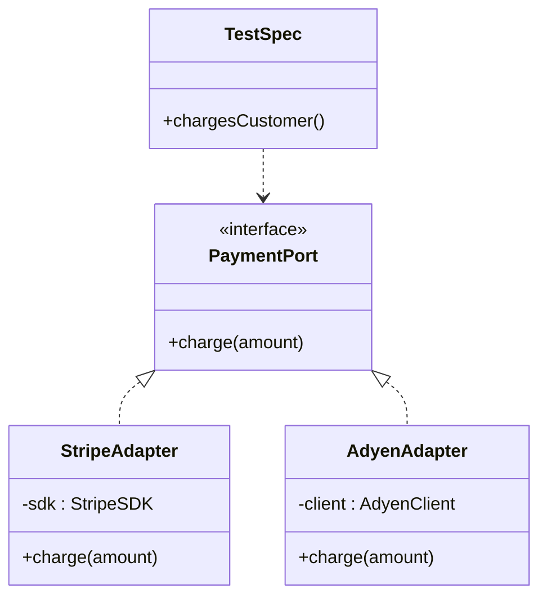

**Decorator (wrap any test with retry)**

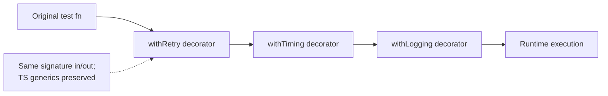

**Strategy (auth)**

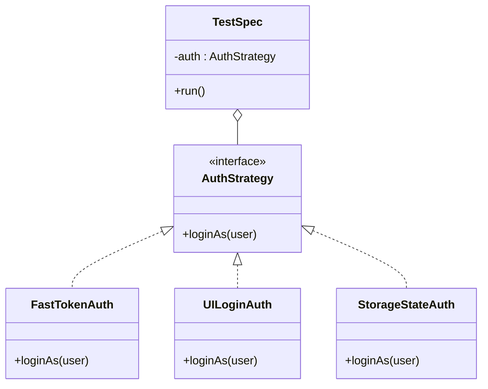

**Observer (custom reporter)**

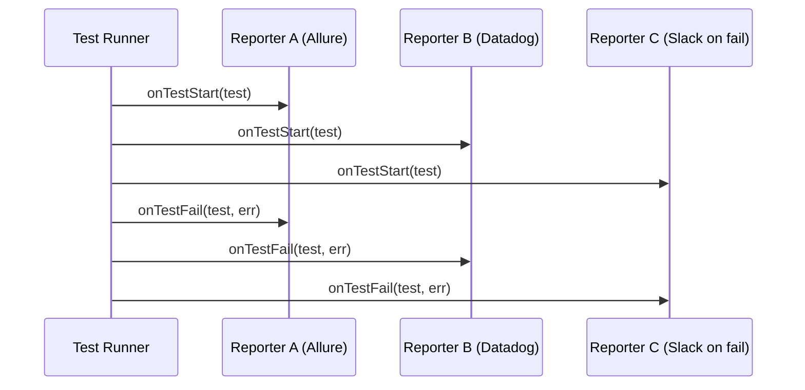

**Chain of Responsibility (failure handlers)**

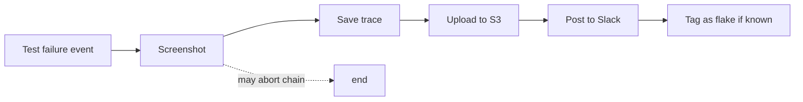

---

## Chunk 4 — Architectural Patterns + Principles + Anti-patterns

**Extends `designPatterns` (10 Qs)**

The patterns that decide how a *framework* is structured, plus the
principles that decide *whether the code is good*, plus the
anti-patterns that show up in every legacy suite. This is where senior
candidates differentiate from mid-level.

| # | Topic | Diff | Notes |
|---|---|---|---|
| 1 | **Singleton — and why it's almost always the wrong choice in tests** | mid | Shared driver/page singletons look elegant, kill parallelism. Refactor with worker-scoped fixtures. |
| 2 | **Dependency Injection / IoC** | hard | Playwright fixtures are DI in disguise. Why hand-rolled `getDriver()` ages badly. |
| 3 | **Repository pattern for test data** | mid | Hide the "where does my fixture live" — DB / API / file — behind a port. Enables seamless switch. |
| 4 | **State machine pattern** | hard | Tests that walk a UI state machine explicitly (logged-out → logging-in → logged-in → locked). Useful in payments / banking. |
| 5 | **Command + Memento** | hard | Record actions as commands → replay across browsers. Snapshot/restore test state with Memento. |
| 6 | **SOLID applied to tests** | hard | Single Responsibility: one fixture, one concern. Open/Closed: extend a POM, don't edit the base. Each principle has a test-specific failure mode. |
| 7 | **DRY vs DAMP / WET in tests** | mid | "Descriptive And Meaningful Phrases" beats DRY in test code — tests are read 100× more than refactored. |
| 8 | **Four-phase test (Meszaros)** | easy | Setup → Exercise → Verify → Teardown. AAA = phases 1–3 collapsed. GWT = BDD framing. When each variant fits. |
| 9 | **Test shape patterns: Pyramid / Trophy / Diamond / Honeycomb** | hard | Each shape solves a different cost curve. Pick wrong → you pay it in maintenance forever. |
| 10 | **Anti-pattern catalogue** | mid | Sleep abuse, fragile selectors (XPath by index), test interdependence, magic numbers, fixture mutation, shared mutable state, hidden global setup. With refactor recipes. |

### Structural diagrams — Chunk 4

**Singleton trap (why it breaks parallelism)**

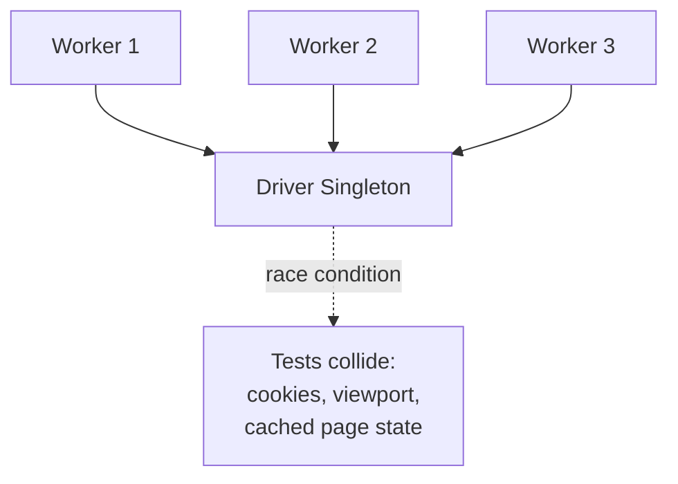

**Dependency Injection via Playwright fixtures**

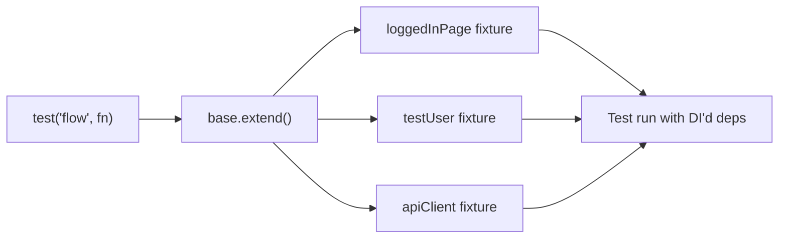

**State machine pattern in tests**

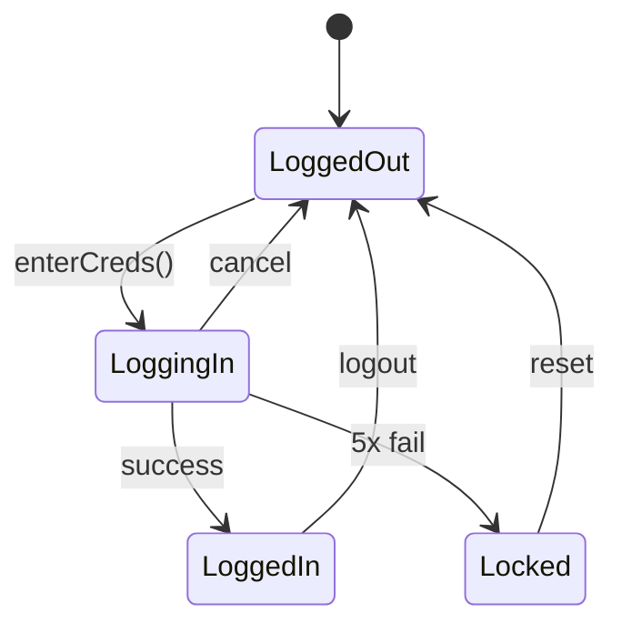

**Test shape patterns (Pyramid / Trophy / Diamond / Honeycomb)**

```mermaid
graph TB
  subgraph PYR["Pyramid (classic)"]
    P1[E2E] --> P2[Integration] --> P3[Unit]
  end
  subgraph TRO["Trophy (Kent C. Dodds)"]
    T1[E2E] --> T2[Integration ← widest] --> T3[Unit] --> T4[Static / types]
  end
  subgraph DIA["Diamond (broad integration)"]
    D1[E2E] --> D2[Integration ← widest] --> D3[Unit]
  end
  subgraph HON["Honeycomb (Spotify, microservices)"]
    H1[Implementation detail tests] --> H2[Integration ← widest] --> H3[Integrated tests]
  end
```

**Four-phase test (Meszaros)**

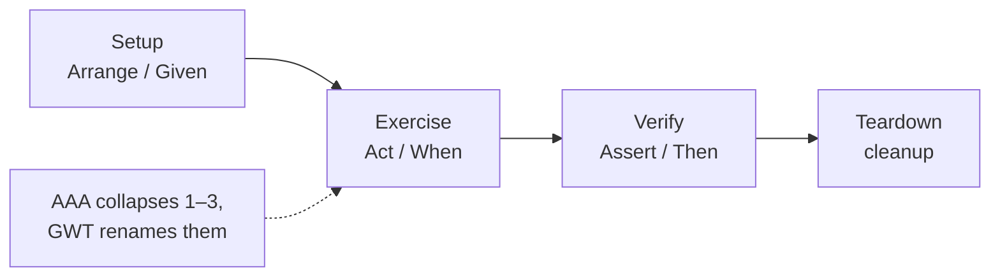

---

**Definition of done — Chunks 1–4 combined:**

- 40 questions in a new `designPatterns` category
- Each Q has at minimum: one Mermaid diagram, one TypeScript/Playwright
  code example, one named anti-pattern or trade-off
- Reading the category linearly teaches the test-pattern landscape
  end-to-end; a senior candidate can name + contrast 15+ patterns by the
  end
- Sources cited at the top of the category description (GoF, Meszaros,
  GOOS, Screenplay paper, Fowler)

---

## Chunk 5 — Test Plan Authoring (How to actually write one)

**Extends `testManagement` (~8 Qs)**

The category currently has 10 Qs on what *belongs* in a test plan but
not enough on the actual authoring craft. Add:

| # | Question | Diff | Notes |
|---|---|---|---|
| 1 | The IEEE 829 / ISO 29119 test-plan template — what to keep, what to skip in 2026 | mid | Old standard, still pragmatic for sections to include. |
| 2 | Test plan vs. test strategy — write the same project as both, contrast | mid | Strategy = stable policy; plan = per-release. |
| 3 | RACI for a multi-team test plan | mid | Who's Responsible / Accountable / Consulted / Informed. |
| 4 | Entry & exit criteria — concrete numeric examples (not "code is stable") | mid | Coverage %, escape rate, P0 count, perf budget. |
| 5 | Test estimation — three techniques (analogous, three-point PERT, capacity-based) | hard | When each fits. Reality of QA estimates. |
| 6 | The "1-page test plan" — when senior QA writes nothing more | mid | For small feature releases; what makes the cut. |
| 7 | Test plan reviews — how to run one without it becoming theatre | mid | Pre-read, focused agenda, action items. |
| 8 | Living test plans — how to keep one alive in an agile environment | mid | Anti-pattern: the test plan written once, never opened. |

**Definition of done:** a QA candidate could write an end-to-end test
plan from the corpus alone, in any of the standard templates.

---

## Chunk 6 — Domain Playbook: Payments + E-commerce

**New category: `domainPlaybooks` (~10 Qs, first batch)**

| # | Question | Diff | Notes |
|---|---|---|---|
| 1 | Payments: what's different about testing money? | hard | Idempotency, exact decimals, fraud signals, PCI scope. |
| 2 | Payments: 3DS / SCA flows — testing the redirect dance | hard | Sandbox creds, success/failure/timeout, regulatory edge. |
| 3 | Payments: refund + chargeback + reversal — three states people confuse | mid | When each fires, who initiates, test data setup. |
| 4 | Payments: testing across a payment-method matrix (cards / wallets / SEPA / BNPL) | hard | Why "one card" smoke isn't enough; tooling (Stripe test cards). |
| 5 | Payments: settlement vs. authorization — the bug class that ships every year | mid | Auth succeeds, capture fails, customer sees double charge. |
| 6 | E-commerce: cart + inventory race conditions | hard | Two users, one item; FOR UPDATE locks; testing concurrency. |
| 7 | E-commerce: pricing / promo / coupon interactions | mid | Decision table — multi-promo stacking is the bug source. |
| 8 | E-commerce: search relevance testing | hard | Not "did search return results" but "did it return the *right* results". Synonyms, typo tolerance. |
| 9 | E-commerce: international taxes & currencies | mid | Rounding rules per country; tax-inclusive vs exclusive display. |
| 10 | E-commerce: GDPR data deletion across order history | mid | "Right to be forgotten" — what stays (legal), what goes. |

**Definition of done:** any QA candidate interviewing at Stripe, Adyen,
Klarna, Mollie, Zalando, eMAG, or Shopify can use these 10 Qs as their
primary domain prep.

---

## Chunk 7 — Domain Playbook: Healthcare + Medical Devices

**Extends `domainPlaybooks` (~8 Qs)**

| # | Question | Diff | Notes |
|---|---|---|---|
| 1 | Healthcare regulated software (IEC 62304) — what changes for QA? | hard | Class A/B/C, doc requirements, traceability obligation. |
| 2 | ISO 13485 quality system — how QA evidence is collected differently | hard | Records, audit trails, immutability. |
| 3 | HIPAA / GDPR-Health — test data must never be real PHI | mid | Synthetic data generators, masking, audit. |
| 4 | Medical UI: the "do no harm" assertion — testing safety alarms | hard | Critical alarms must fire even under DB failure; chaos test. |
| 5 | EHR / FHIR API testing — schema validation against HL7 standards | mid | Required fields per profile; backward compat across FHIR versions. |
| 6 | Medical devices: hardware-in-the-loop testing — when emulators lie | hard | Sensor noise, real timing, fail-safe states. |
| 7 | Clinical decision support: testing without practising medicine | mid | Edge cases without claiming therapeutic outcomes. |
| 8 | Healthcare release cycles — why they're slow and how QA fits | mid | Validation runs, formal approval gates; no "hotfix to prod". |

**Definition of done:** any QA candidate interviewing at Roche, Siemens
Healthineers, Philips Health, Babylon, Doctolib, or a medical-devices
startup has domain-specific prep.

---

## Chunk 8 — Domain Playbook: Logistics + (Stretch) Automotive Safety

**Extends `domainPlaybooks` (~8 Qs)**

| # | Question | Diff | Notes |
|---|---|---|---|
| 1 | Logistics: testing route optimisation — the oracle problem | hard | "Did the route get *better*?" — no perfect oracle. Property-based testing. |
| 2 | Logistics: time-zone bugs at scale — pickup vs. delivery windows | mid | DST transitions; cross-border. Concrete data. |
| 3 | Logistics: tracking / event sourcing — testing immutable event streams | hard | Out-of-order events, late arrivals, replays. |
| 4 | Logistics: warehouse barcode / RFID scan testing | mid | Misreads, duplicates, scanner offline; reconciliation. |
| 5 | Logistics: last-mile delivery — testing real-world failures (no signal, address wrong) | mid | Graceful degradation; retry strategies. |
| 6 | Automotive (ISO 26262): ASIL ratings and how QA maps to them | hard | ASIL-D vs ASIL-A test rigour; V-model in safety context. |
| 7 | Automotive: HIL (hardware-in-the-loop) vs SIL (software-in-the-loop) | hard | Where each finds bugs; cost trade-off. |
| 8 | Automotive: AUTOSAR / SOME-IP message testing | hard | Why you can't test these from a web stack mindset. |

**Definition of done:** the `domainPlaybooks` category totals ~26 Qs
across 3 domains. Candidate can speak credibly to logistics
(DHL/FedEx/Maersk/Cargus), automotive (Continental/Bosch/Stellantis),
and the prior payments + healthcare verticals.

---

## What this plan deliberately does NOT include

- **No new "ISTQB Fundamentals" path.** Decided "pause until target job
  is clear" in the previous session. If automotive is the target, this
  chunk is added; otherwise skipped.
- **No "Deep Automation Engineering" path as a *separate* category.** The
  design-patterns Chunks 1–2 cover the architectural depth a senior SDET
  interview probes. Adding a third category here would re-widen the
  corpus exactly when we just narrowed it.
- **No accessibility / mobile / security-beyond-auth Qs.** Real gaps,
  but per the finalopinion.md decision they belong in a follow-up
  audit, not in the Task 2 scope.
- **No retroactive rewrite of the AUDIT.md top-10 thin answers.** That's
  a separate quality-polish pass; tracked but not in this plan.

---

## Execution order & estimated effort

| Chunk | Effort (writing + verify) | Net Qs added |
|---|---|---|
| 1. UI / Page Modelling Patterns | 4–5 hr | +10 |
| 2. Test Data + Test Doubles | 4–5 hr | +10 |
| 3. GoF Structural + Behavioral in tests | 4–5 hr | +10 |
| 4. Architectural + Principles + Anti-patterns | 4–5 hr | +10 |
| 5. Test Plan Authoring | 2 hr | +8 |
| 6. Payments + E-commerce | 3–4 hr | +10 |
| 7. Healthcare | 2–3 hr | +8 |
| 8. Logistics + Automotive | 2–3 hr | +8 |
| **Total** | **~25–32 hr** | **+74** |

Final corpus size: 243 + 74 = **317 Qs across 20 categories** — slightly
above the pre-cut size but with bloat replaced by targeted senior
material (40 design patterns with diagrams, 26 domain Qs, 8 test-plan
authoring Qs) rather than generic JS fundamentals.

---

## Per-chunk verification

Every chunk's PR/commit must pass:
1. `npm run typecheck` clean
2. `npm test` 43/43 (integrity invariants)
3. `npm run build` succeeds
4. Sidebar shows the new category with the right Q count
5. At least 3 random Qs in the new chunk are spot-read by the user
   before merge — quality gate, not just shape gate.

---

## Open decisions before Chunk 1 starts

1. **Naming.** Confirm `designPatterns` and `domainPlaybooks` as
   category IDs. They become URL slugs / state keys forever.
2. **Chunk 1 priority.** Start with UI / Page Modelling Patterns
   (Chunk 1 — cross-domain value, sets the vocabulary for Chunks 2–4)
   or with Payments domain (Chunk 6 — concrete, urgent for some
   target roles)? Recommend Chunk 1.
3. **Anchor frameworks.** All examples in TS/Playwright, or include
   one Cucumber/Selenium/Cypress contrast Q per chunk? Recommend
   TS/Playwright primary, single contrast Q only where it changes the
   pattern's shape (e.g. App Actions is meaningfully different in
   Cypress; Screenplay maps best to Java/Serenity-BDD examples).
4. **Diagram tooling.** Confirm Mermaid as the diagram source for all
   40 design-pattern Qs — it's already wired into the app via the
   `diagram:` field on `Question` and the existing `Diagram.tsx`
   component. No new tooling required.

Answer these four when you're ready to start Chunk 1; everything else
is in the plan.
